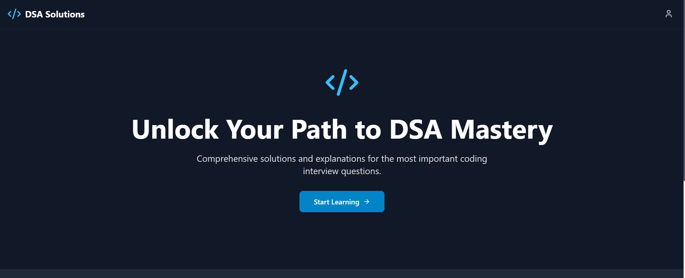
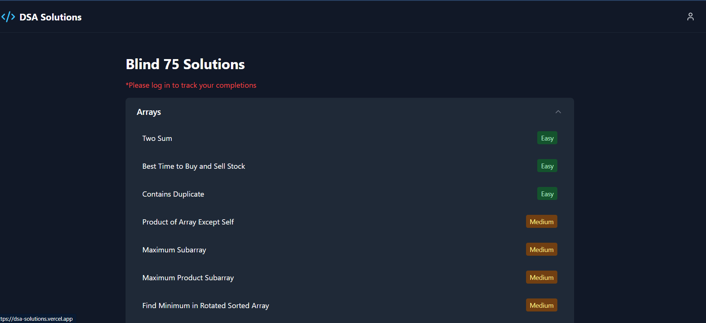
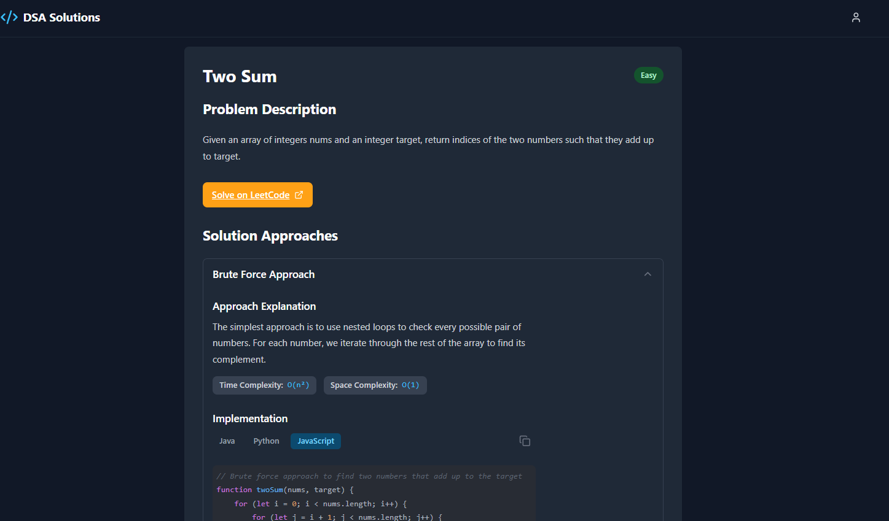

## DSA solutions

A simple project where we can find solutions and explanations about DSA questions.

These list can be helpful to master the DSA concepts.

## 📸 Screenshots

Here are some screenshots of the project:

- 
- 
- 

## Authors

- [@vijay-kumar-bantu](https://www.github.com/vijay-kumar-bantu)

## Setup the project

run the project with npm after installion of node_modules

### Install the modules

#### npm

```bash
  npm install --legacy-peer-deps
```

#### pnpm

```bash
  pnpm i
```

### Run the Project

```bash
  npm run dev
```

## 🚀 About Me

This is Vijay Kumar Bantu.

Working as a Fullstack developer.

## 🔗 Links

[](https://main-portfolio-five-alpha.vercel.app/)
[](https://www.linkedin.com/in/vijay-kumar-bantu/)
